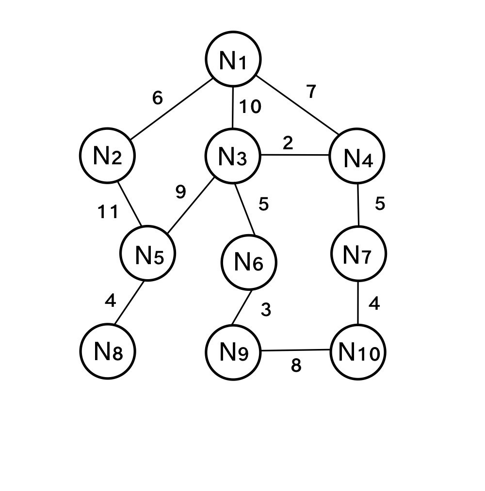

# Práctica 2

## Preguntas

### ¿Qué variable representa la lista ABIERTA?
La variable que representa a la lista ABIERTA es **openSet**. Esta se encuentra en la línea 44 de la clase pública AStar.
### ¿Qué variable representa la función g?
La variable que representa a la función g es **gScore**. Esta se encuentra en la línea 48 de la clase pública AStar.
### ¿Qué variable representa la función f?
La variable que representa a la función f es **fScore**. Esta se encuentra en la línea 52 de la clase pública AStar.
### ¿Qué método habría que modificar para que la heurística representara la distancia aérea entre vértices?
El método que habría que modifica para representar la distancia aérea con la heurítica sería el método **heuristicCostEstimate()**, que se encuentra en la línea 119 de la clase pública AStar.
### ¿Realiza este método reevaluación de nudos cuando se encuentra una nueva ruta a un determinado vértice? Justifique la respuesta.
El código, como se puede observar de la línea 57 a la 69, si que realiza el método de reevaluación de nudos. En este método, el código compara la **"f"** dos vértices. Dependiendo de sus valores, registra el vértice cuya **"f"** sea inferior.

## Grafo

